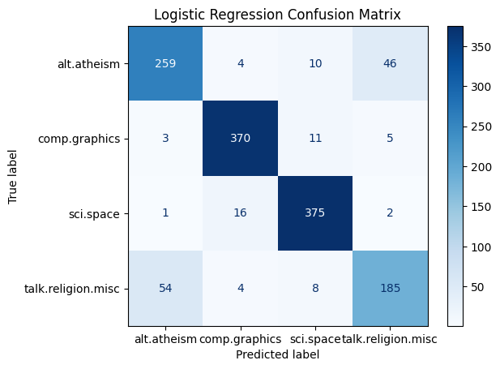
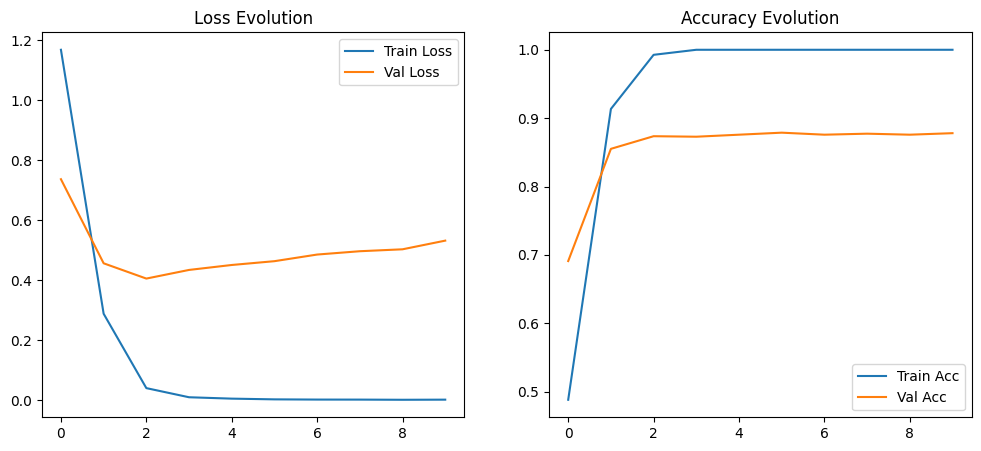
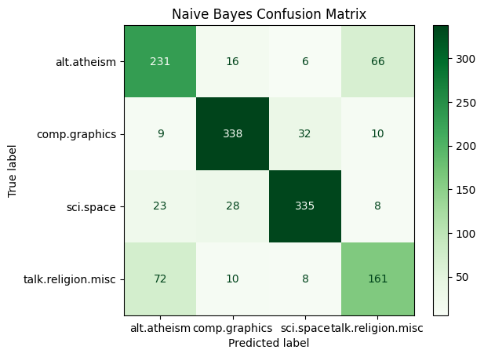
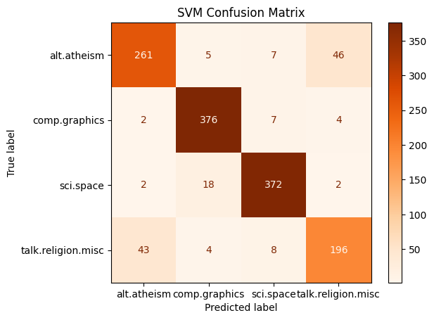

## 20_NEWSGROUP_DATASET
Mathematical Foundations, Data Loading, Preprocessing, Feature Extraction, Model Building, Evaluation

Performance hierarchy observed with CNN outperforming traditional ML models.

This project analyzes text classification on the 20 Newsgroups dataset using both machine learning and deep learning approaches. It compares TF-IDF with LSA and deep CNN models.

The project demonstrates the effectiveness of deep learning in natural language processing tasks, providing a benchmark for text classification performance.

CNN accuracy 0.894, Logistic Regression accuracy 0.85.

   

