## BANK_MARKETING
Importing Libraries, Data Preprocessing, Exploratory Data Analysis, Feature Engineering, Model Building, Model Evaluation

Age distribution shows most clients are between 30-50. Job types vary with management and blue-collar being prominent.

This project predicts whether clients will subscribe to a term deposit based on bank marketing data. The dataset includes client information, campaign details, and economic indicators.

It helps banks optimize their marketing strategies by identifying potential customers likely to respond positively to term deposit offers.

Gradient Boosting accuracy 91.2%, AUC 0.92.

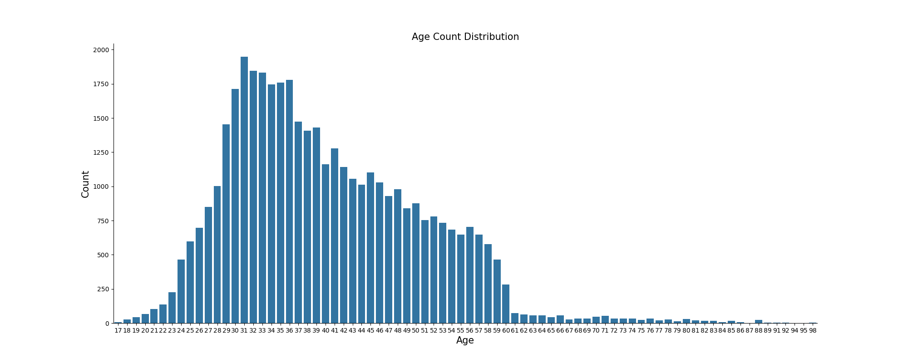 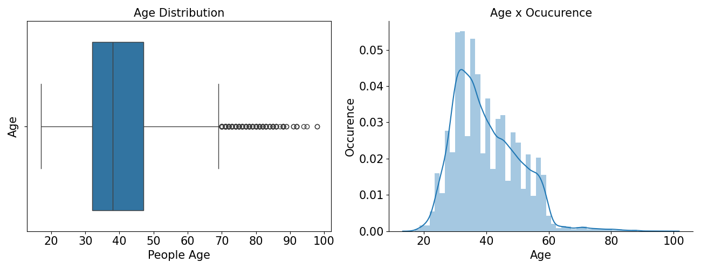 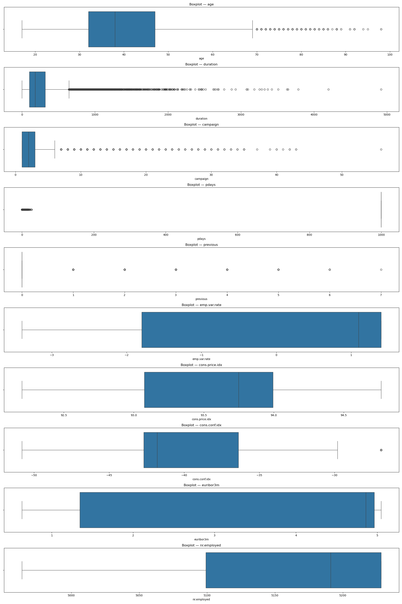  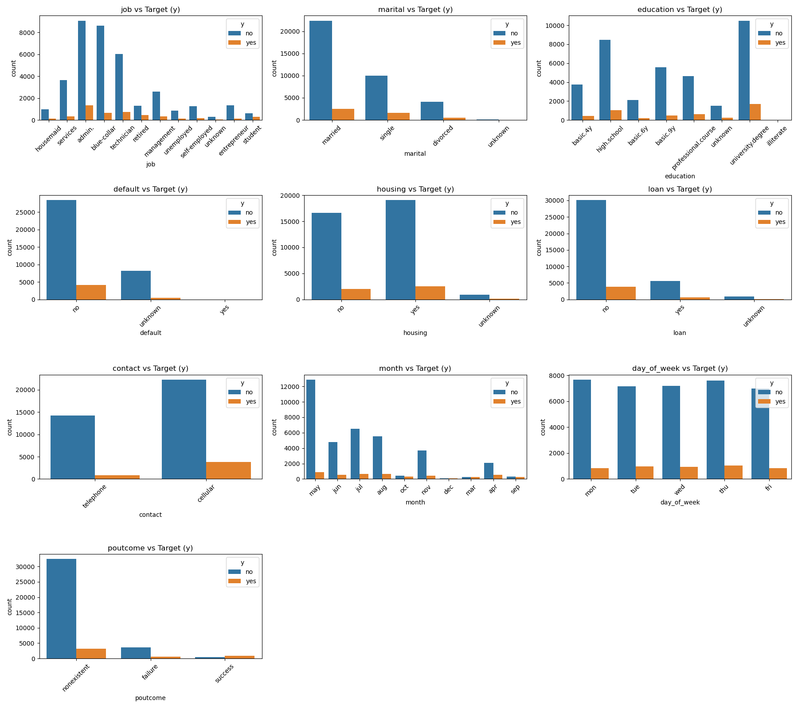 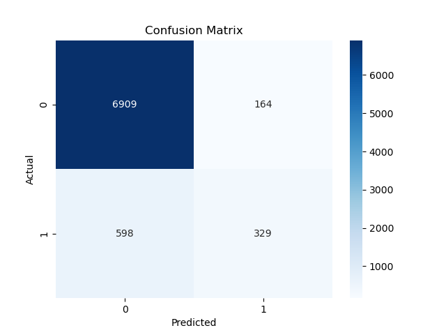 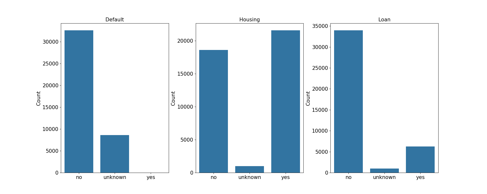 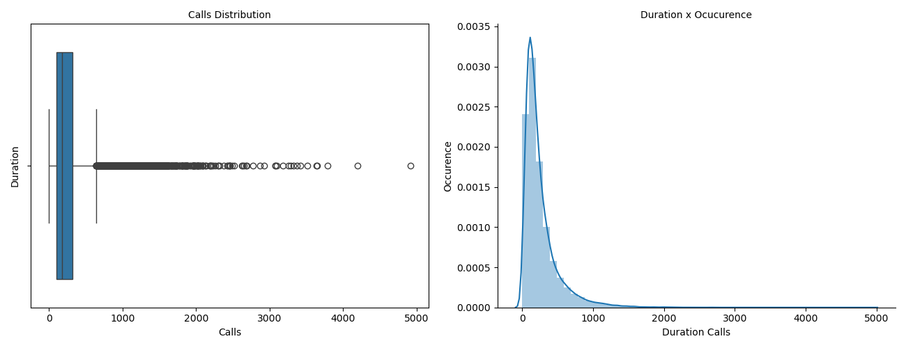 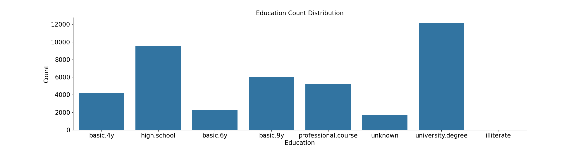 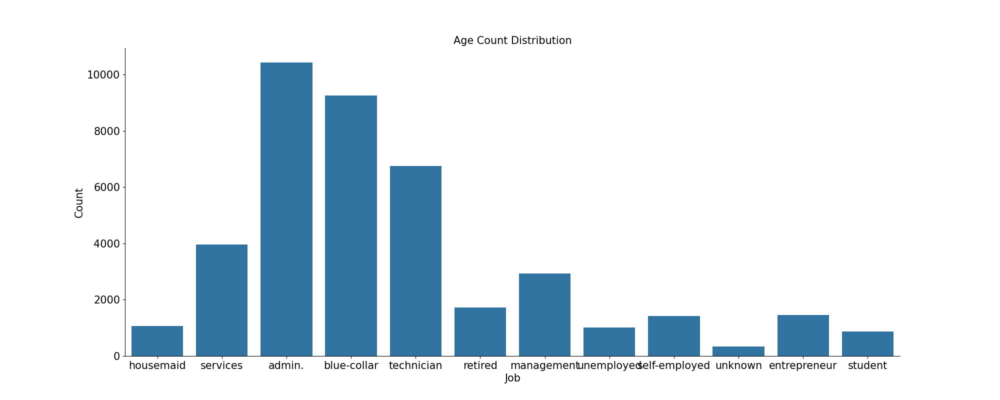 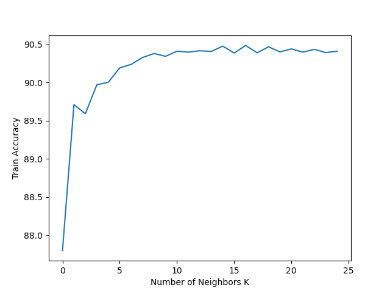 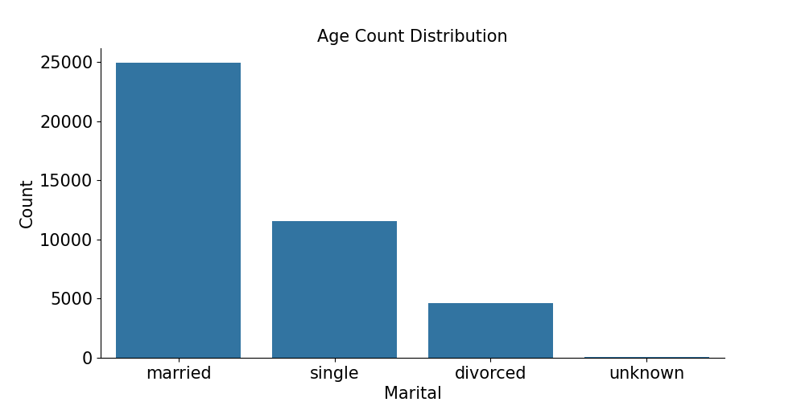 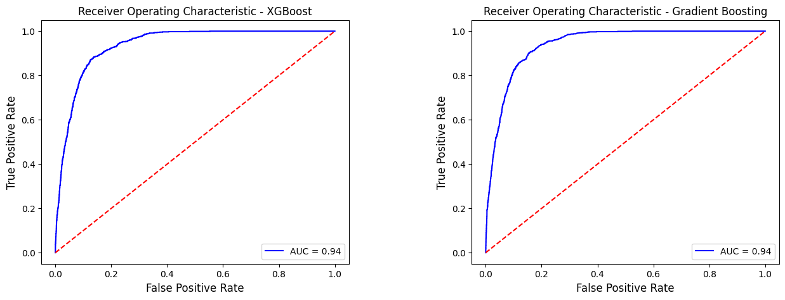 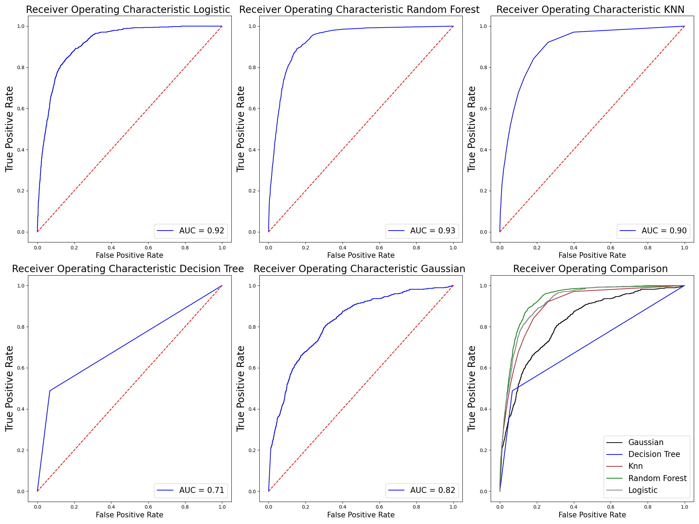 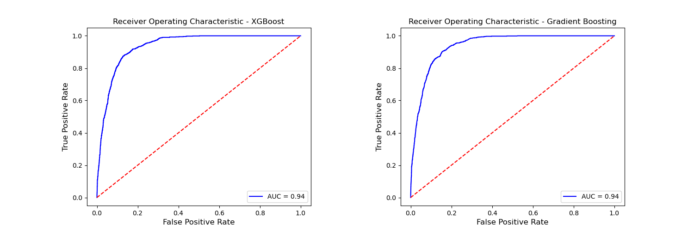

