## BIHAR_ELECTION_2025
Import Libraries, Load Dataset, Data Cleaning, Data Analysis, Visualization

NDA+ secured 205-208 seats.

This project analyzes the Bihar election results for 2025, focusing on seat distribution and alliances. The dataset contains election data from various constituencies.

NDA+ 205-208 seats, MGB 115-120 seats, INDIA 75-80 seats.

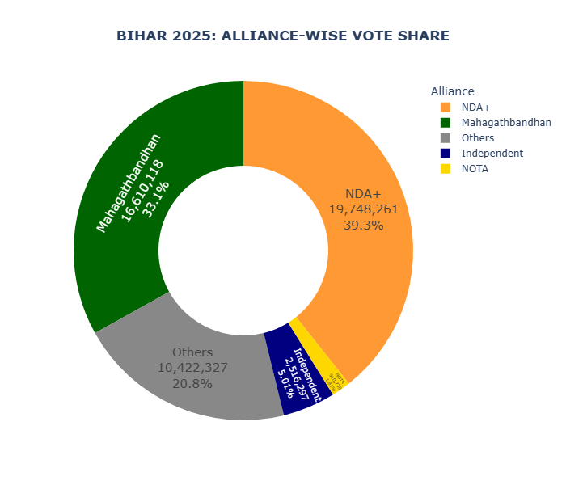 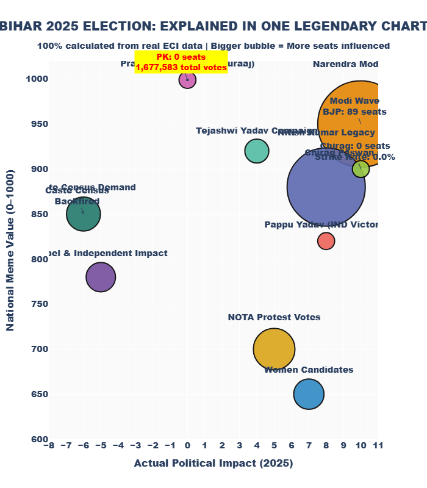 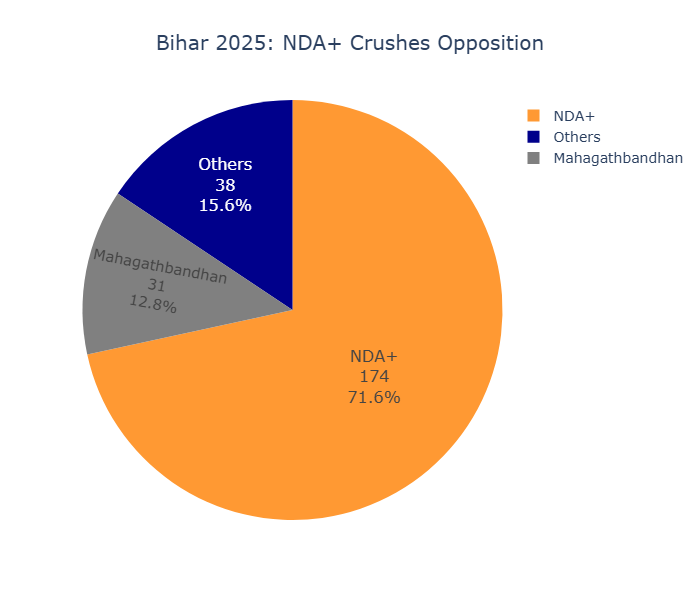 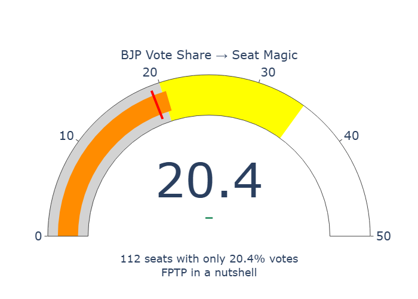 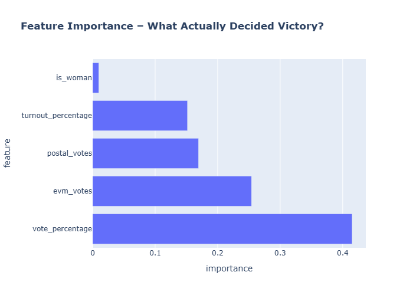 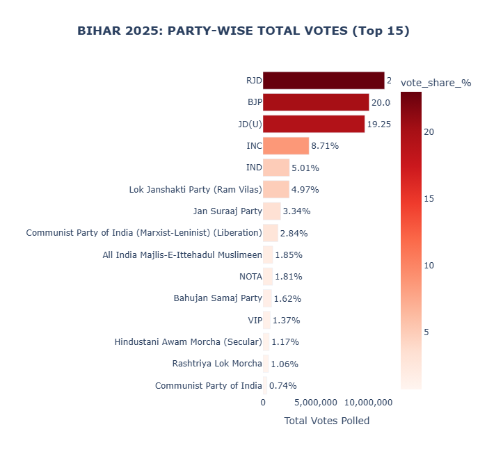 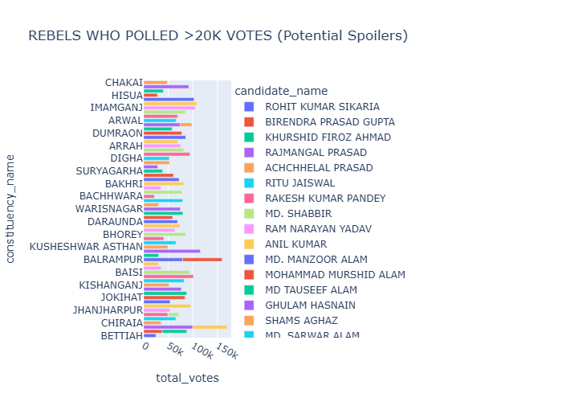 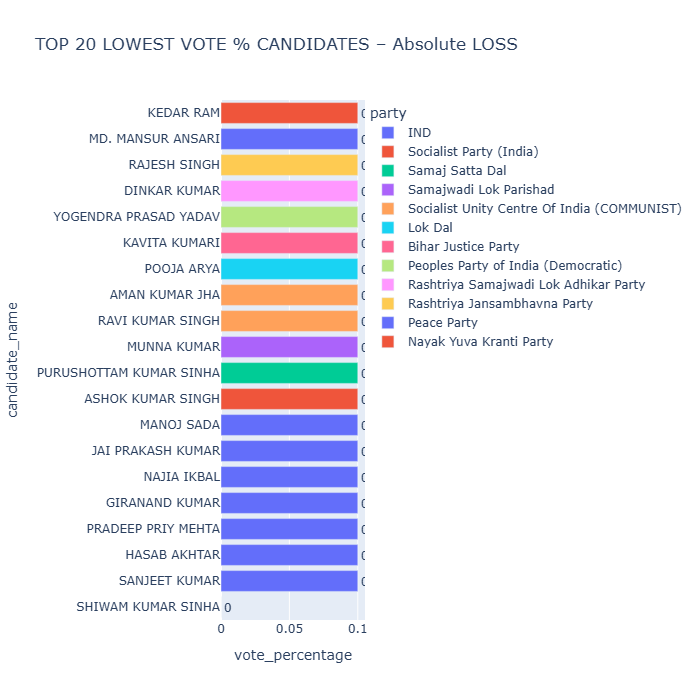 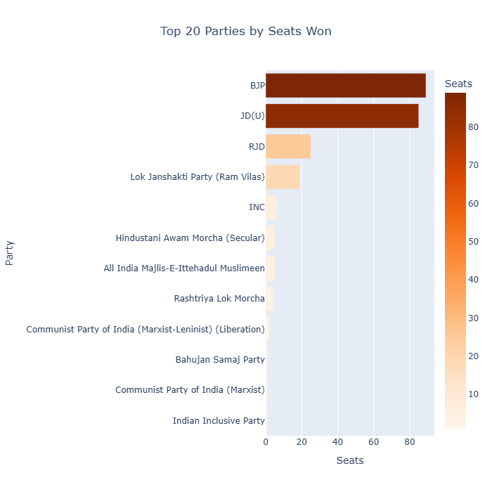 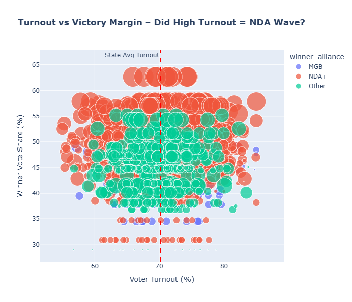 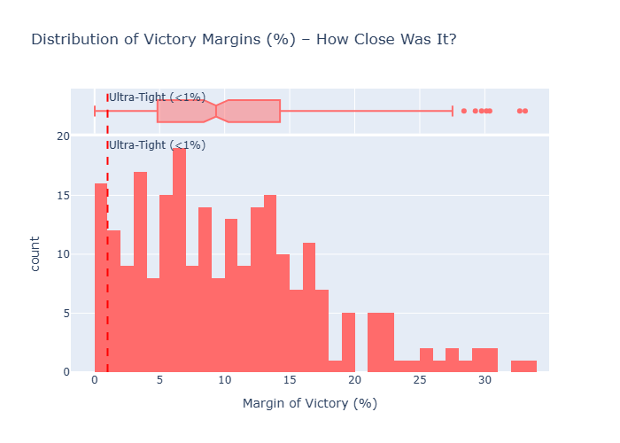 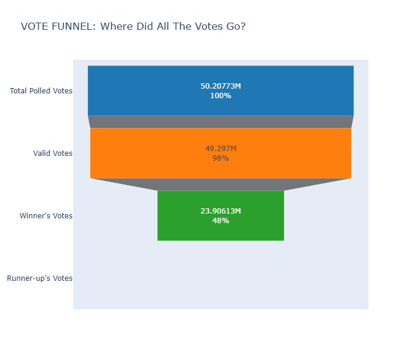 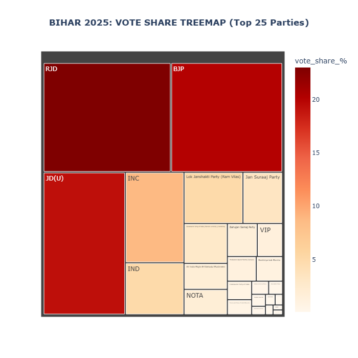 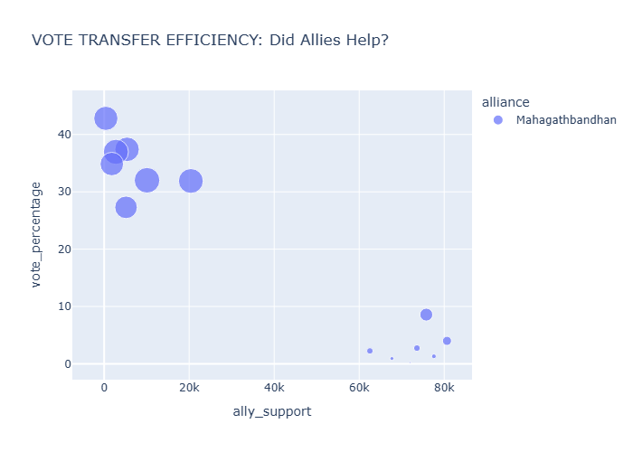 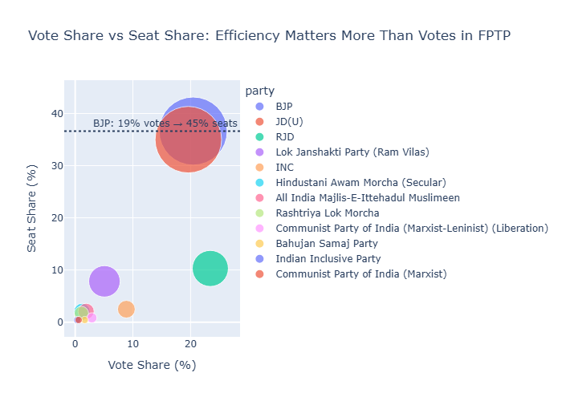 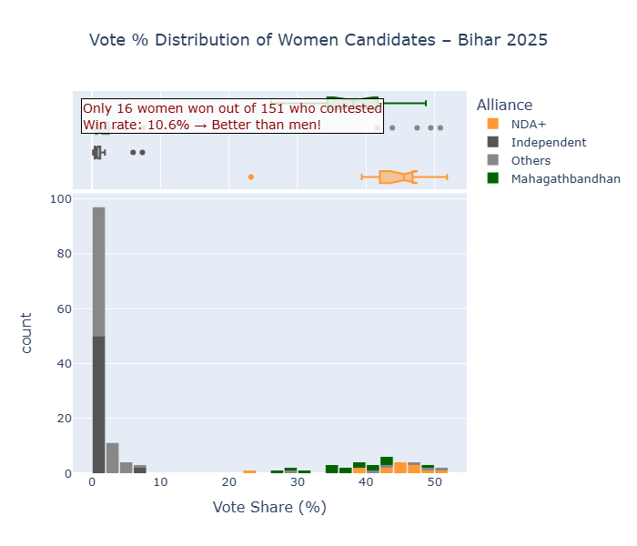

