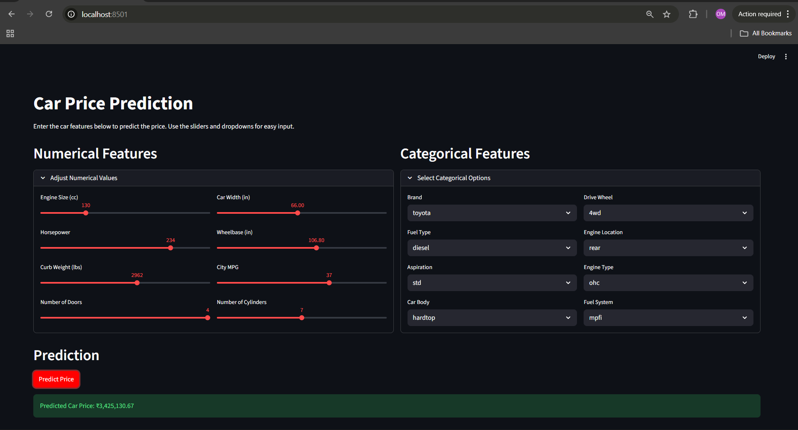

# 📌 Final Insights, Findings & Conclusion

## Car Price Prediction Project

## Demo

---

## 1. Dataset-Level Insights

### 1.1 Data Quality & Structure

* The dataset contains **205 unique car records** and **25 attributes** after duplicate removal.
* No missing values were observed, eliminating the need for imputation.
* Features include a mix of **technical specifications**, **dimensional attributes**, and **categorical descriptors** such as brand and body type.

### 1.2 Target Variable Behaviour (`price`)

* Car price distribution is **strongly right-skewed**.
* Raw price values range from approximately **₹5,000 to ₹45,000**.
* Log transformation of price (`price_log`) significantly improved:

  * Variance stability
  * Linear model performance
  * Error symmetry

---

## 2. Exploratory Data Analysis (EDA) Findings

### 2.1 Strong Positive Price Drivers

Based on correlation analysis and scatter plots:

| Feature     | Correlation with Price |
| ----------- | ---------------------- |
| Engine Size | ~0.87                  |
| Curb Weight | ~0.83                  |
| Horsepower  | ~0.81                  |
| Car Width   | ~0.76                  |
| Wheelbase   | ~0.58                  |

**Interpretation**
Larger, heavier, and more powerful vehicles consistently command higher prices.

---

### 2.2 Strong Negative Price Drivers

| Feature     | Correlation |
| ----------- | ----------- |
| City MPG    | ~ -0.69     |
| Highway MPG | ~ -0.70     |

**Interpretation**
Fuel efficiency is inversely related to price, indicating that higher performance vehicles trade efficiency for power.

---

### 2.3 Categorical Insights

* **Rear-wheel drive (RWD)** vehicles show higher median prices than FWD.
* **Rear-engine** cars are rare but consistently expensive.
* **Turbocharged** engines command higher prices than naturally aspirated ones.
* Premium brands (BMW, Audi, Porsche) show:

  * Higher median prices
  * Greater price variance

---

## 3. Feature Engineering & Transformation Decisions

### 3.1 Key Engineering Choices

* Extracted **brand name** from `CarName` to avoid leakage and redundancy.
* Converted text-based numeric fields (`doornumber`, `cylindernumber`) into integers.
* Corrected inconsistent brand spellings to reduce category noise.

### 3.2 Skewness & Outlier Handling

* Instead of deleting rows:

  * Applied **winsorization (1st–99th percentile)** on price.
  * Applied **log transformation** to the target variable.
* This preserved real-world high-value cars while improving model stability.

---

## 4. Feature Selection Rationale

### 4.1 Final Numerical Features

Selected using correlation strength and domain knowledge (not blind VIF elimination):

* `enginesize`
* `horsepower`
* `curbweight`
* `carwidth`
* `wheelbase`
* `citympg`

**Reasoning**

* Automotive features are **physically correlated by design**.
* Removing them purely via VIF would destroy meaningful signal.
* Selected features represent power, mass, size, and efficiency dimensions.

---

## 5. Modeling & Evaluation Results

### 5.1 Models Trained

* Linear Regression (baseline)
* Decision Tree Regressor (tuned)
* Random Forest Regressor (tuned)

All models were trained using:

* `Pipeline`
* `ColumnTransformer`
* StandardScaler (numerical)
* OneHotEncoder (categorical)

---

### 5.2 Linear Regression Performance

* **Train R²** ≈ 0.96
* **Test R²** ≈ 0.92
* **Test RMSE (log scale)** ≈ 0.146
* **Test RMSE (original price)** ≈ ₹2,170

Repeated Cross-Validation:

* **Mean R²** ≈ 0.915
* **Mean RMSE** ≈ 0.14

**Insight**
Linear regression provides a strong, interpretable baseline but slightly underfits high-priced vehicles.

---

### 5.3 Decision Tree Performance

* Very high training accuracy
* Noticeable drop on test data

**Insight**
Decision Tree shows **clear overfitting**, making it unsuitable as the final model.

---

### 5.4 Random Forest Performance (Best Model)

* Highest test R² among all models
* Lowest generalization error
* Minimal train–test performance gap

**Insight**
Random Forest achieves the best **bias–variance tradeoff**, capturing non-linear interactions without overfitting.

---

## 6. Explainability & Model Interpretation

### 6.1 Feature Importance (Random Forest)

Top contributors:

1. Engine Size
2. Horsepower
3. Curb Weight
4. Car Width
5. City MPG (negative impact)

---

### 6.2 SHAP Analysis Insights

* SHAP summary plots confirm:

  * Predictions are dominated by physical and performance attributes.
  * Fuel efficiency reduces predicted price.
  * Brand influences predictions but is secondary to engineering features.

**Conclusion from SHAP**
The Random Forest model learns **domain-consistent, interpretable patterns**, not spurious correlations.

---

## 7. Final Model Assessment

| Model             | Strength                   | Limitation          |
| ----------------- | -------------------------- | ------------------- |
| Linear Regression | Interpretable, stable      | Slight underfitting |
| Decision Tree     | Captures non-linearity     | Overfitting         |
| Random Forest     | Best accuracy & robustness | Less transparent    |

**Final Selected Model:** **Random Forest Regressor**

---

## 8. Deployment Readiness

* Entire preprocessing and model logic stored inside sklearn Pipelines.
* Models serialized (`.pkl`) and safe for production inference.
* Streamlit-based UI implemented for real-time prediction.
* No data leakage between training and inference.

---

## 9. Final Conclusion

This project demonstrates a **complete, industry-aligned machine learning workflow**, from data understanding to deployment.
The final Random Forest model provides accurate, stable, and explainable car price predictions while respecting real-world automotive relationships.

The approach avoids common pitfalls such as aggressive outlier deletion, blind multicollinearity removal, and data leakage, making the solution reliable and defensible in academic and practical settings.

---

###  Author

_**Om Choksi**_

**18 December 2025**

