## ESTIMATING_OBESITY_LEVELS
Step 1 | Importing Data & Libraries, Step 2 | Data Understanding, Step 3 | Exploratory Data Analysis, Step 4 | Data Preprocessing, Step 5 | Feature Engineering, Step 6 | Model Building, Step 7 | Model Evaluation

The data has no null values. The target variable 'NObeyesdad' has 7 classes. Feature engineering included creating BMI categories. Correlation analysis showed relationships between weight, height, and obesity levels.

This project aims to estimate obesity levels based on eating habits and physical condition. The dataset includes features like age, height, weight, family history, and eating habits to predict obesity categories.

LightGBM achieved an accuracy of 0.9143. Other models like CatBoost and XGBoost were also evaluated.

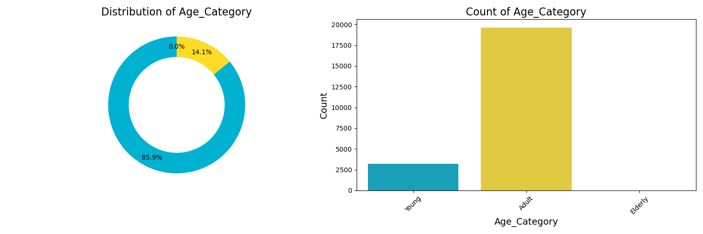 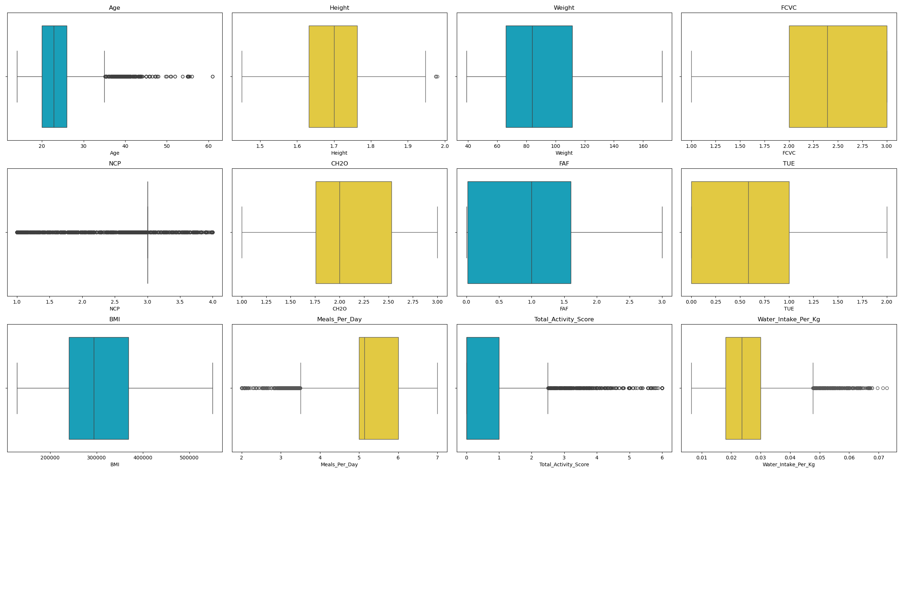 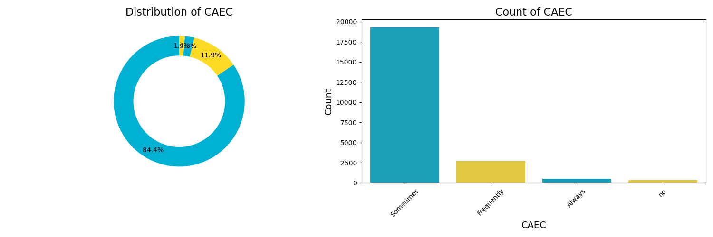 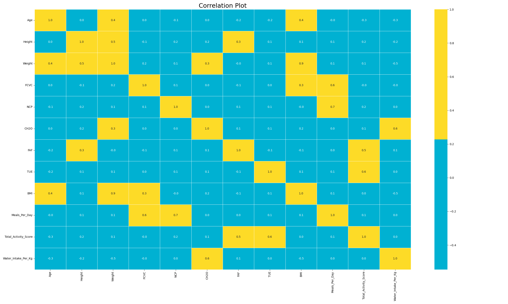 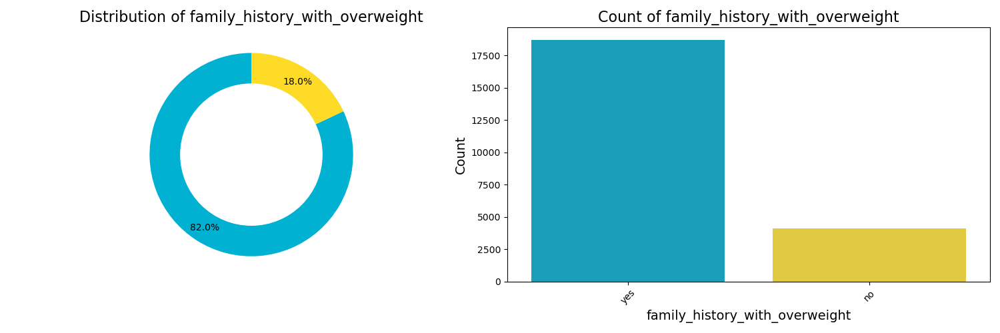 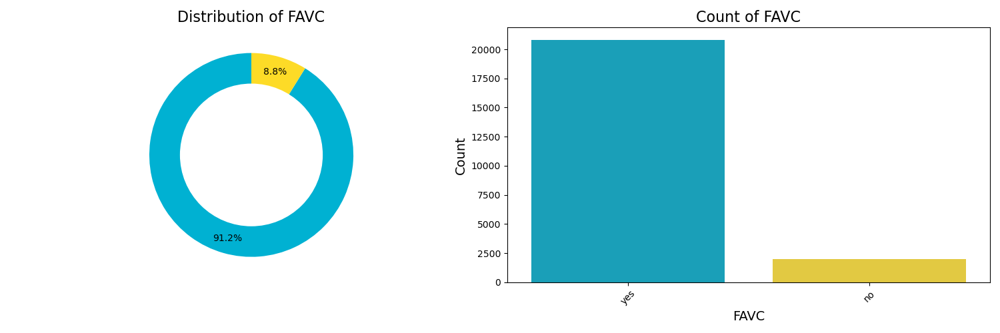 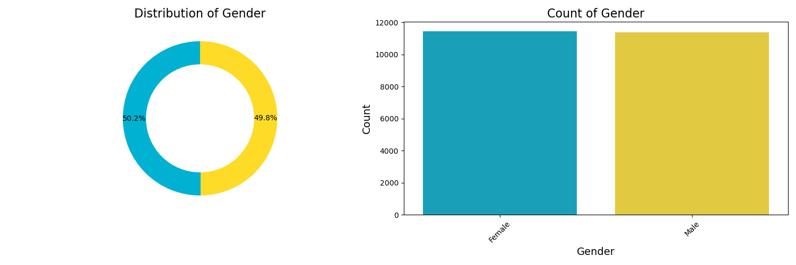 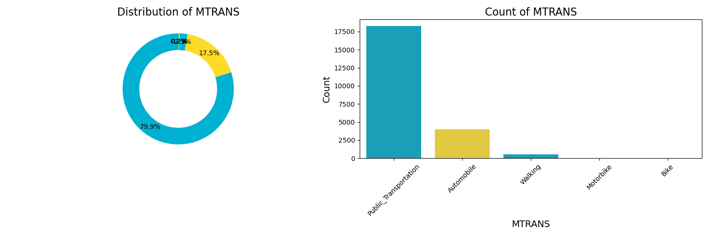 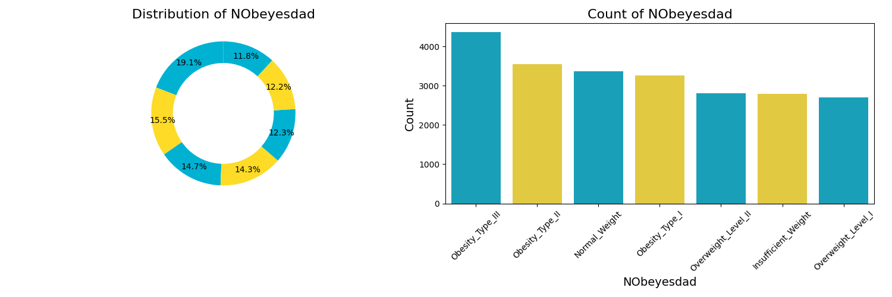 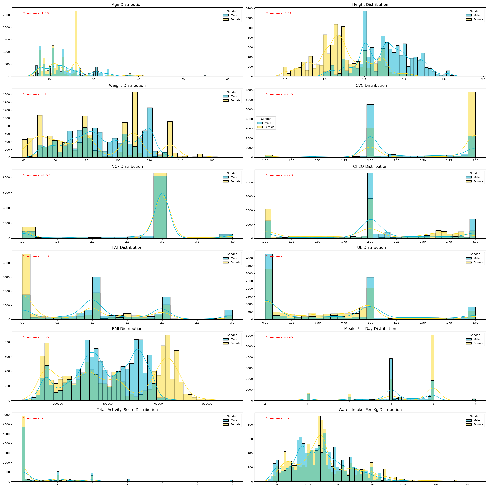 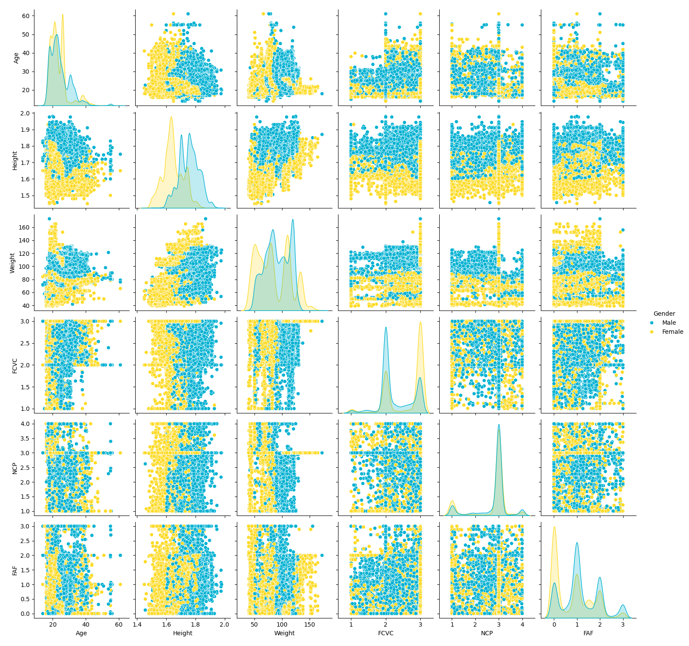 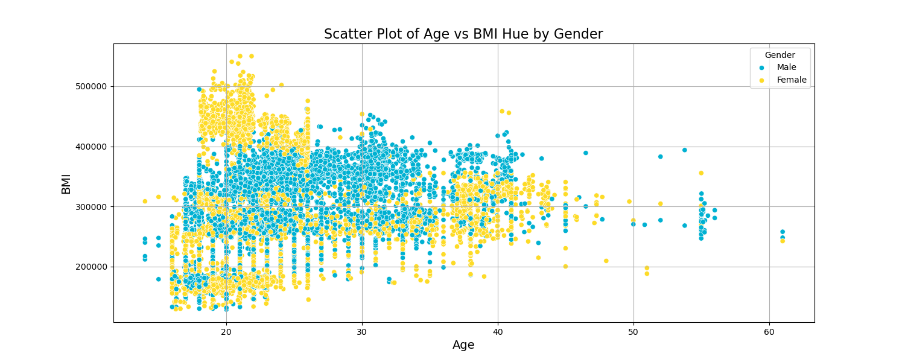 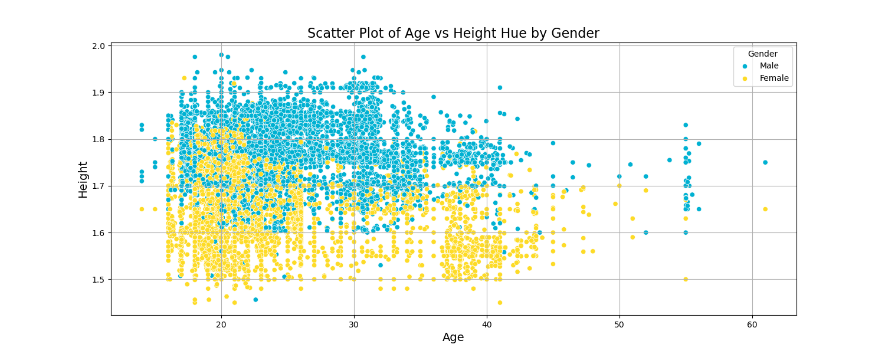 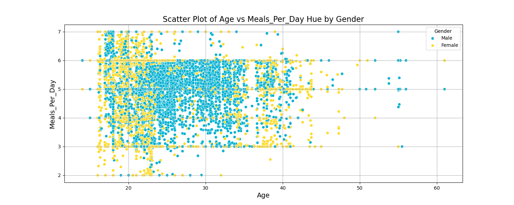 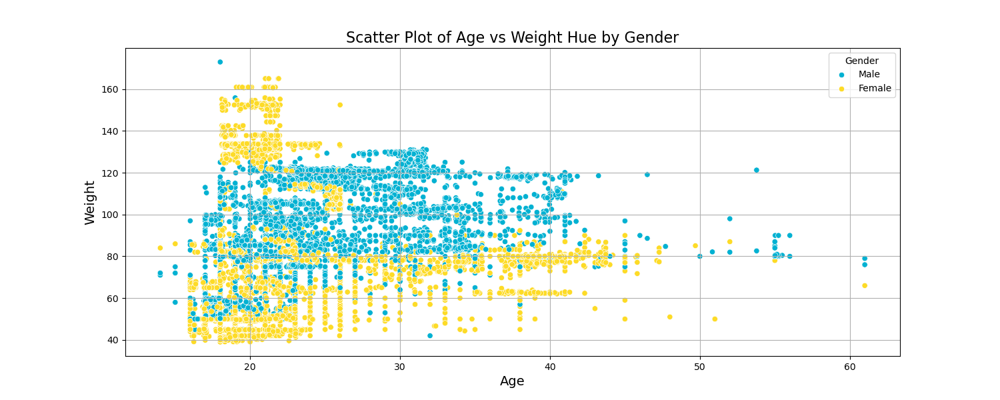 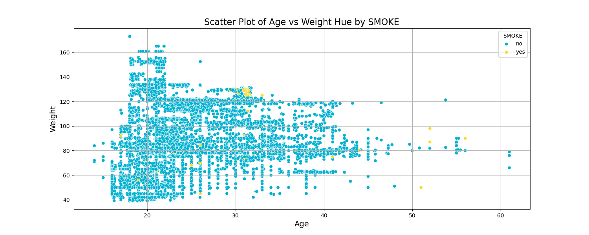 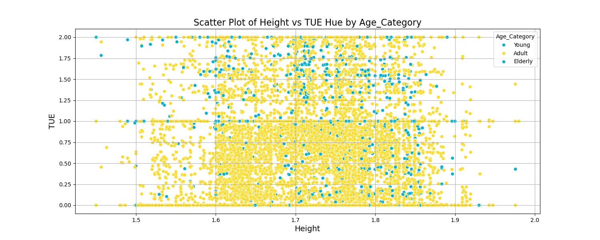 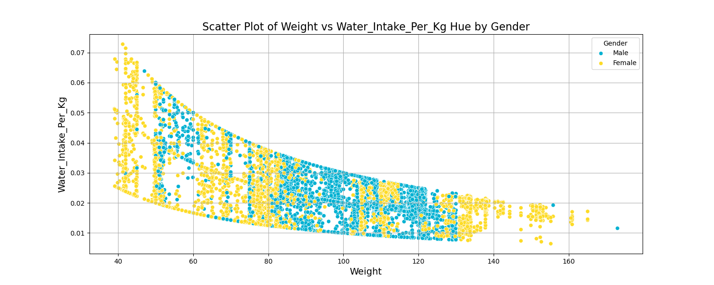 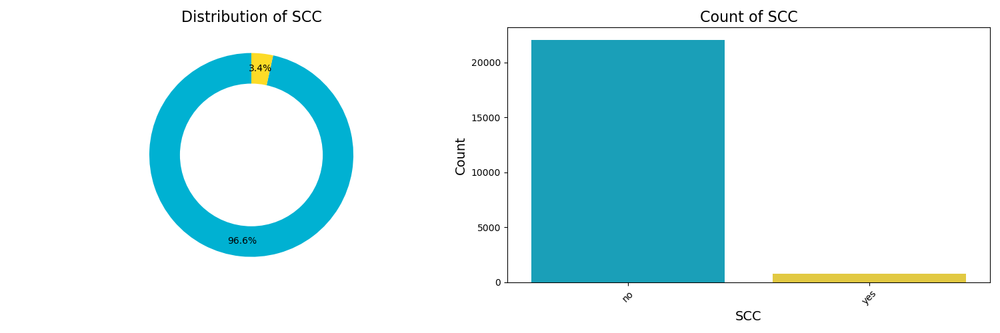 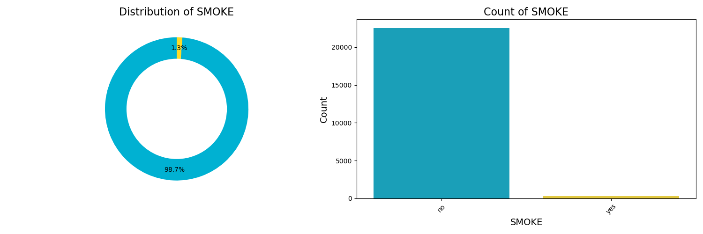

