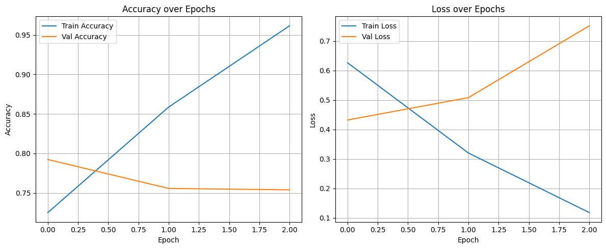
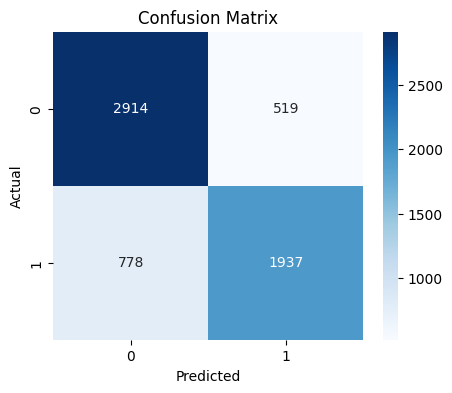
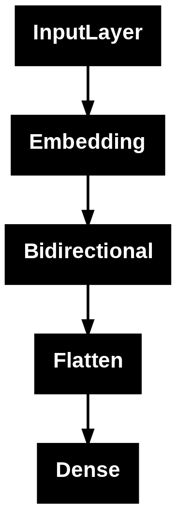
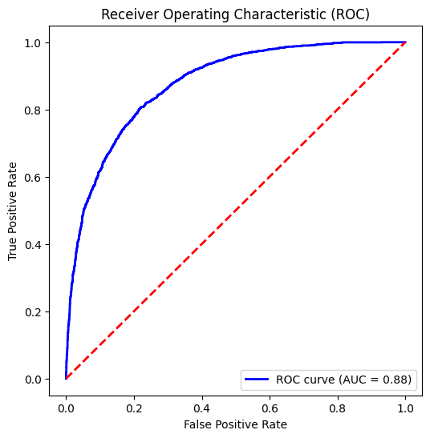

## HOTEL_RATING_PREDICTION
Import Library, Load Dataset, Data Preprocessing, Text Preprocessing, Model Building, Model Evaluation

N/A

This project predicts whether hotel reviews are 5-star or not using text classification. The dataset contains TripAdvisor hotel reviews.

It involves natural language processing to analyze review text and determine sentiment, helping to automate the rating process for hotels.

The model achieved an accuracy of 0.789. CNN model was used for text classification.

   

