## RANSOMWARE_ATTACK_DETECTION
Installing Libraries, EDA, Data Preprocessing, Feature Engineering, Model Building, Model Evaluation

The data has no null values. Feature extraction included ImageBase, Entropy, etc.

This project detects ransomware attacks using static PE file analysis. The dataset contains features extracted from PE files.

Stacking model achieved ACC 0.9951, AUC 0.9996. Other models like Random Forest were evaluated.

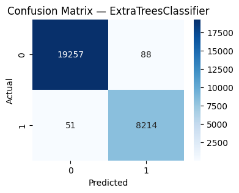 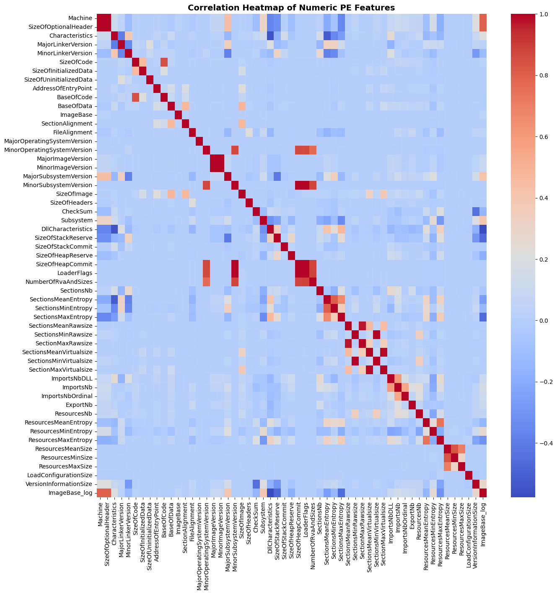 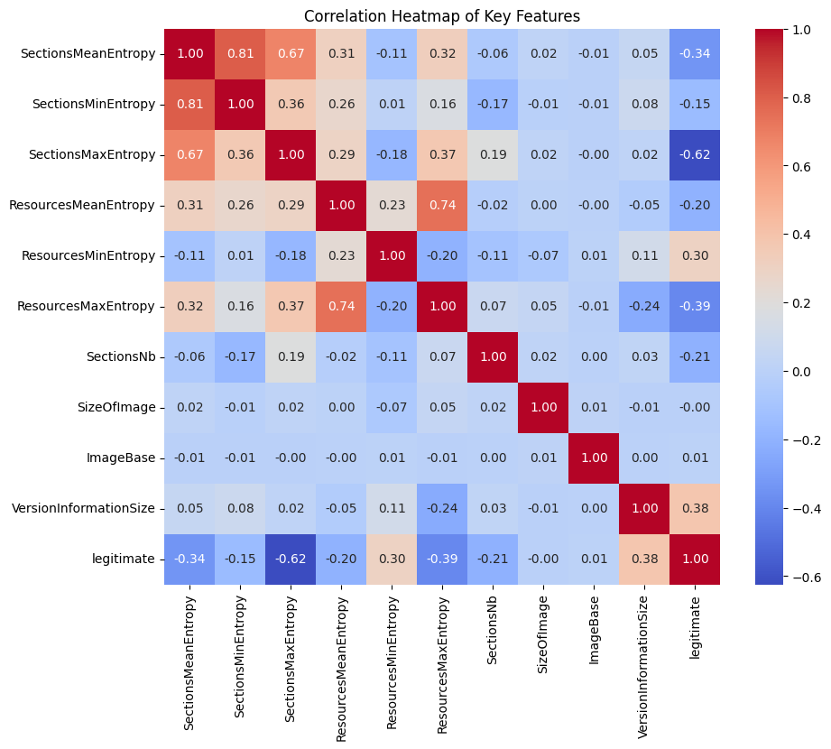 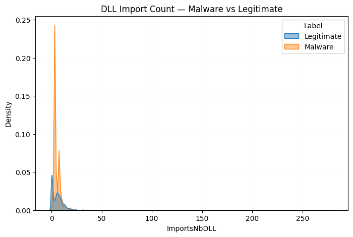 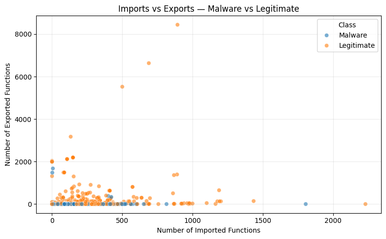 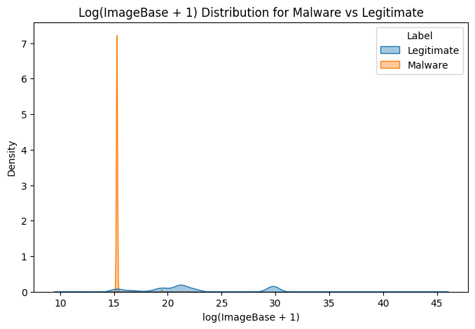 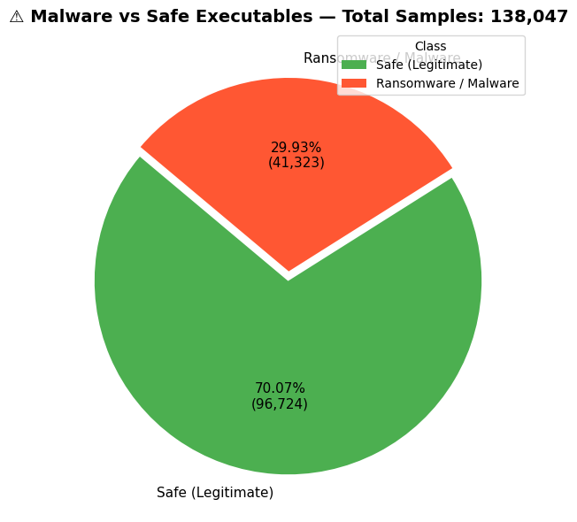 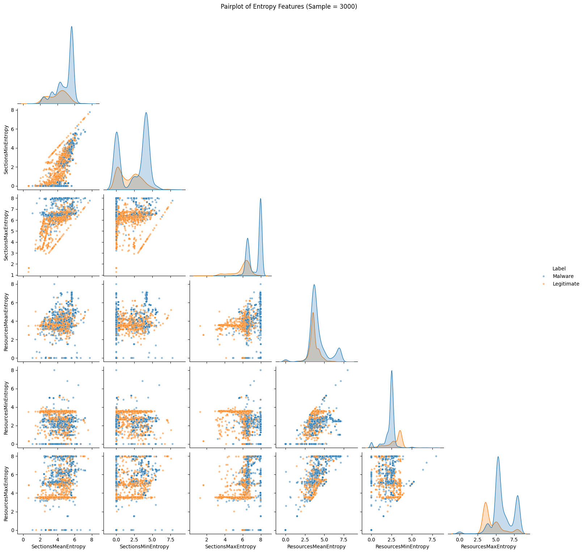 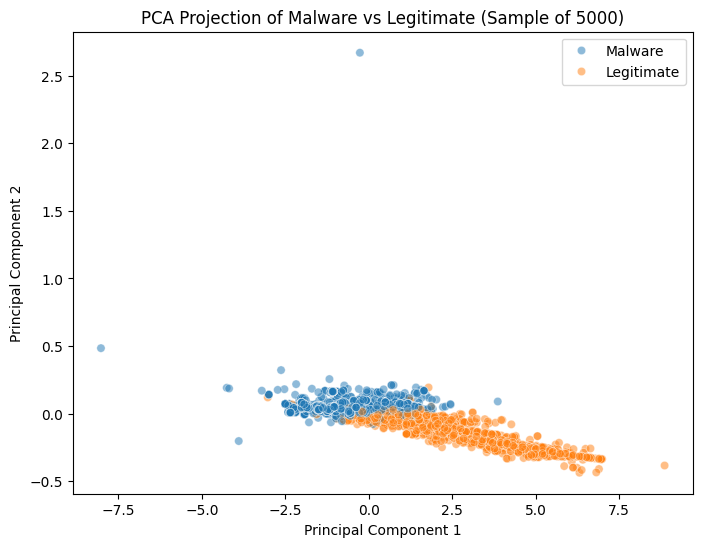 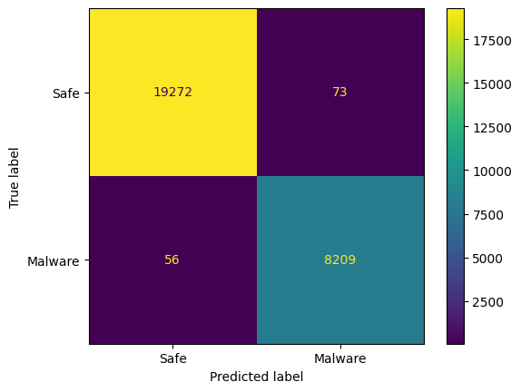 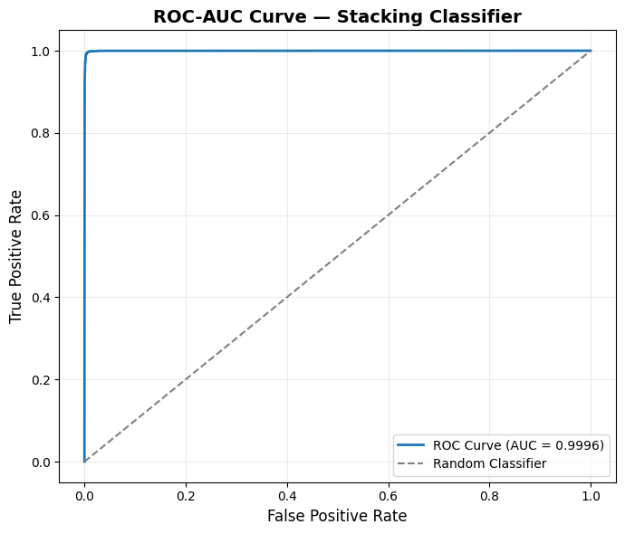 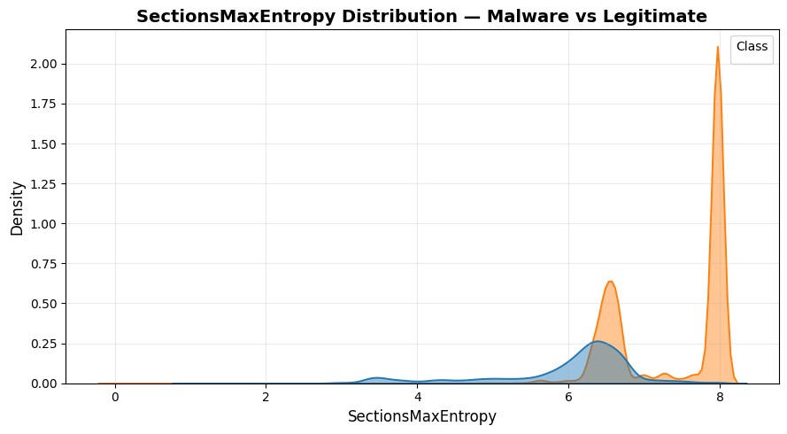 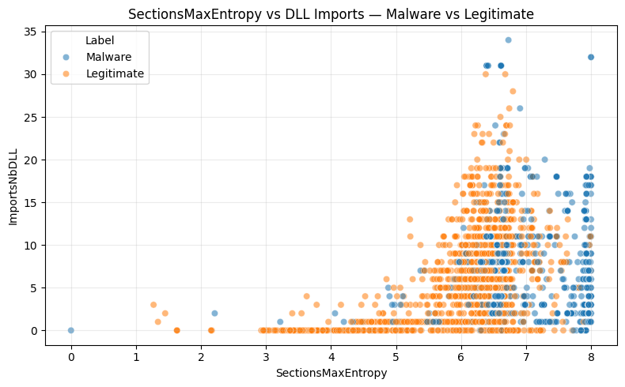 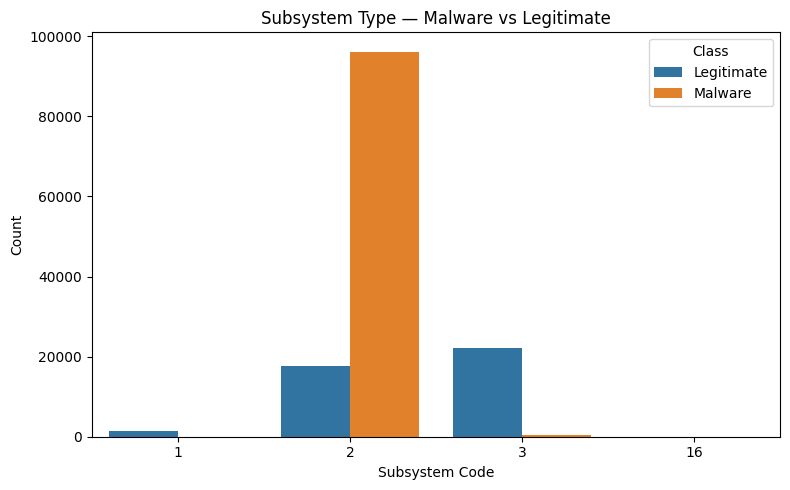 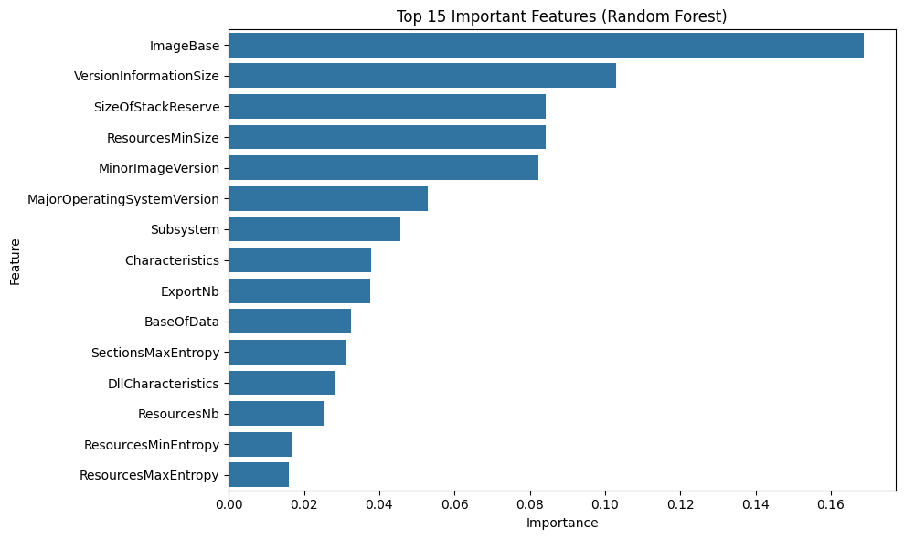 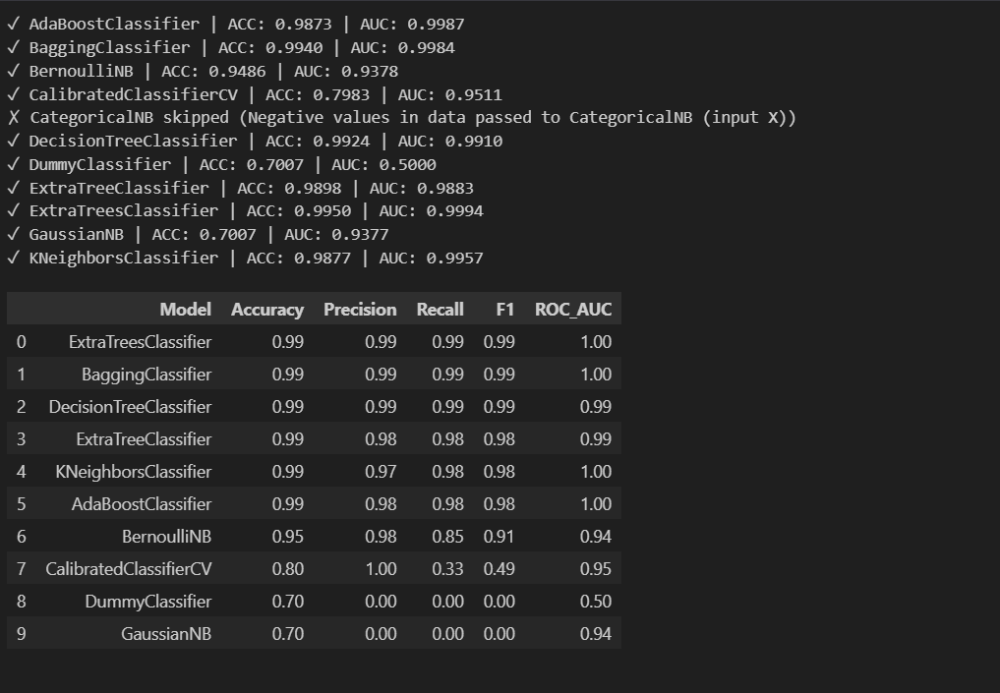 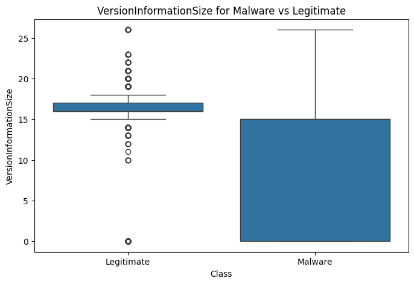

